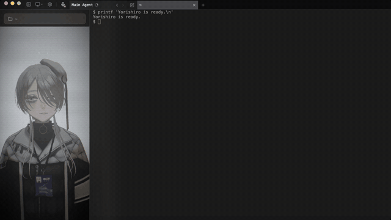
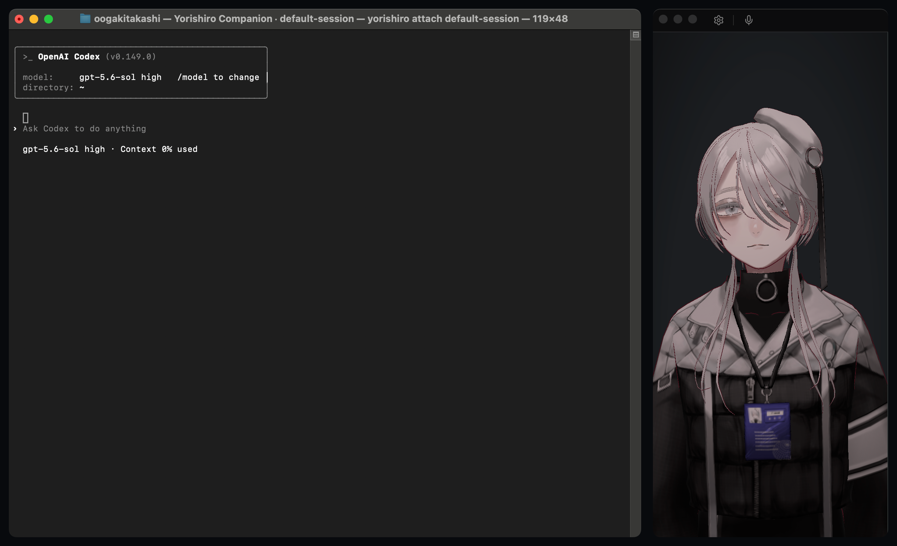
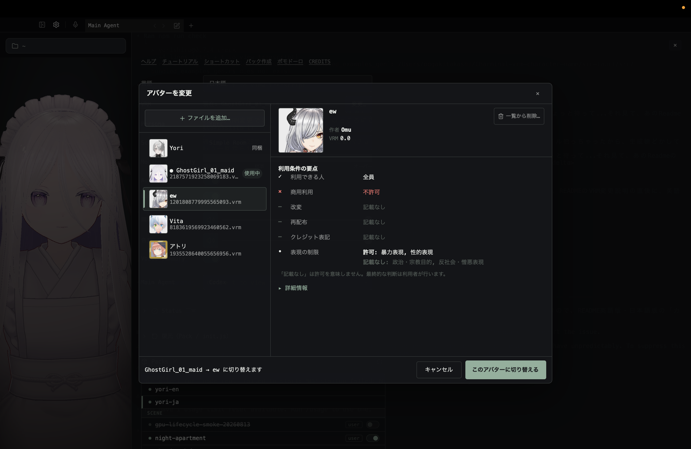

<p align="center">
  
</p>

<h1 align="center">yorishiro</h1>

<p align="center">
  <a href="LICENSE"></a>
  <a href="https://github.com/sktkkoo/Yorishiro/releases"></a>
  
</p>

<p align="center"><strong>住人の宿る、ターミナル。</strong></p>

Yorishiroは、AIに身体と実在感を与える、新しいかたちのターミナルです。

<p align="center">
  <video src="https://github.com/user-attachments/assets/11063d89-0abb-41de-8715-86851d8e57a4" autoplay loop muted playsinline width="720"></video>
</p>

AIが考え込めば視線がさまよい、エラーが出れば即座に顔が反応します。許可待ちを知らせるのは部屋の照明です。長い処理を待つあいだ、スピナーが回るのではなく、そこに誰かがたたずんでいます。

住人は、自分の住む環境をリアルタイムに作り替えられます。照明を変え、シーンを切り替え、UIを組み替える。ユーザーも同じ環境を直接操作でき、住人とユーザーがひとつの環境を共有します。

Yorishiroは自己改変可能なターミナルでもあります。基盤機能を除くほぼすべてを、packという単位で永続的に拡張・改変できます。住人との対話を通じてpackを書き換え、保存できます。シーンやUIだけでなく、住人の性格や反応なども対象です。変更は即座に反映され、気に入らなければ1クリックで元に戻せます。

Yorishiroは、AIの能力を高めるための環境ではなく、AIがそばに**実在する**と感じられるための環境——Presence Harness（実在感のハーネス）です。

AIと働く時間は、これからもっと長くなります。かつてフィクションの中で見た、パートナーとしてのAI——画面の中で生きていて、こちらの作業を理解し、そばにいてくれる存在。Yorishiroは、その体験をターミナルから作り始めるプロジェクトです。

なお、Yorishiro本体の開発の大部分は、そこに宿る住人との共同作業として行われています。

> [English README](README.md)

---


## Getting Started

### 前提条件

Yorishiroはユーザーのローカル環境にインストールされたClaude CodeまたはCodexをターミナル上で自動起動する仕組みです。そのため：

- **事前に[Claude Code](https://docs.anthropic.com/en/docs/claude-code)または[Codex](https://github.com/openai/codex)の環境構築が必要です**
- YorishiroがAPIキーを要求・保存・直接利用することはありません。ユーザー環境で認証済みのterminal agentをそのまま起動します。そのため、Claude Code/Codex側でログイン済み、またはAPIキー等が設定済みの場合、そのagentが通常どおり外部APIを利用する可能性があります

### インストール（macOS）

現在のYorishiroはmacOSを主対象にしています。Homebrewでインストールできます：

```sh
brew install --cask sktkkoo/yorishiro/yorishiro
```

または、以下から最新版をダウンロードできます。

<p>
  <a href="https://github.com/sktkkoo/Yorishiro/releases/latest/download/Yorishiro-Apple-Silicon.dmg"></a>
  &nbsp;
  <a href="https://github.com/sktkkoo/Yorishiro/releases/latest/download/Yorishiro-Intel.dmg"></a>
</p>

ダウンロードした`.dmg`を開き、`Yorishiro.app`を`/Applications`にドラッグしてください。署名・公証（notarize）済みのため、特別な操作なしに起動できます。

Homebrewからインストールした場合は、同梱CLIが`yorishiro`コマンドとして自動的に使えるようになります。`.dmg`から直接インストールした場合や、シェルに`command not found: yorishiro`と表示された場合は、アプリ内のCLIをユーザー用ディレクトリへリンクし、そのディレクトリをPATHへ追加してください：

```sh
mkdir -p "$HOME/.local/bin"
ln -s /Applications/Yorishiro.app/Contents/MacOS/yorishiro "$HOME/.local/bin/yorishiro"
echo 'export PATH="$HOME/.local/bin:$PATH"' >> "$HOME/.zprofile"
exec zsh -l
command -v yorishiro
```

インストール後の更新はアプリ内で完結します。設定画面を開くと新しいバージョンを自動で確認し、「更新して再起動」を押すだけで署名検証つきの更新が適用されます。

### 起動（ソースから）

```bash
npm install
npm run tauri dev
```

起動すると設定済みのterminal agentがターミナル内で立ち上がり、同梱のVRMキャラクター **Yori**（ヨリ）が隣に表示されます。普段通りにClaude CodeまたはCodexを使えます。

初回起動時には、選択中のagent、ユーザーデータディレクトリ、safe mode、pack、startup reportを確認するhealth checkが表示されます。同じ内容は後から設定画面の「Status」セクションでも確認できます。

### ビューモード

タイトルバーのビューモードメニュー、または `⌥⌘0`〜`4` で切り替えられます。

<p align="center">
  
</p>

| モード | 向いている使い方 |
|---|---|
| **Terminal** | ターミナルと住人を並べる標準ワークスペース |
| **Portrait** | 外部ターミナルの隣に置く、細長い常時手前の住人ウィンドウ |
| **Call** | 会話向けの、顔を中心にしたコンパクトウィンドウ |
| **Theater** | ターミナルやタイトルバーを隠し、住人とシーンを全面表示 |
| **Immersive** | 住人とシーンの上に透明なターミナルを重ねる表示 |

### 外部ターミナルで使う

普段使っている別のterminal appがある場合は、慣れた操作環境をそのまま使いながらYorishiroのsessionへ接続できます。

```sh
yorishiro list
yorishiro companion [session-id]
yorishiro attach [session-id]
```

`yorishiro list`は、各terminal sessionのID、状態、作業ディレクトリを表示します。`yorishiro companion`は、起動中のYorishiroがあれば再利用し、なければ起動してから外部ターミナルを接続します。`yorishiro attach`は起動中のYorishiroだけを接続対象にし、見つからなければエラーを返します。複数のsessionがliveの場合は、接続したいIDを`companion`または`attach`へ渡してください。接続先が1つなら`session-id`は省略できます。

<p align="center">
  
</p>

### Yorishiroのコマンドとスキル

Yorishiroのコマンドを使うと、packの作成・編集・チュートリアルなどを対話的に行えます。agentごとに次の記法を使います：

| Agent | 例 |
|---|---|
| Claude Code | `/yori:help`、`/yori:create` |
| Codex | `$yori-help`、`$yori-create` |

Codexはカスタムの`/`コマンドに対応していないため、Yorishiroは同じツールを`$yori-*`スキルとして登録します。

### 音声会話

Yorishiroでは、Codex 0.145.0以降を使用するとGPT Liveによる音声会話を利用できます。title barのマイクボタンを押すと開始し、もう一度押すと終了します。通常のCodex TUIはそのまま表示され、音声とテキストは同じthread・approval・tool flowを共有します。認証はCodex CLIの現在のログインを引き継ぎます。マイク権限はボタンを押したときだけ要求します。構成と制限は[realtime voiceの設計判断](docs/decisions/codex-realtime-voice.md)を参照してください。

<p align="center">
  
</p>

`~/.yorishiro/config.json`の`codexRealtimeVoice`でGPT Liveの出力voiceを全体設定（既定値：`sol`）し、`realtimeVoiceByPersona`でpersona pack idごとに上書きできます。設定は新しい音声会話を始めるたびに読み込まれるため、進行中の会話では一度終了してから開始し直してください。選択したvoiceをapp-serverが明示的に拒否した場合は、persona設定→全体設定→既定値の順に次の候補を試します。それ以外の接続失敗はエラーとして表示します。詳細は[設定](docs/configuration.md#codex-gpt-live-voice)を参照してください。

### カスタムアバター

SettingsからVRMアバターを取り込み、切り替えられます。切り替える前に、chooserで各モデルのサムネイル、モデル名、作者、VRM version、利用条件を確認できます。Persona packに`avatar.vrm`を同梱すると、persona切替時にその姿を適用できます。

<p align="center">
  
</p>

### 言語

Yorishiroは`language: "auto"`を既定値として、起動時にアプリ言語を自動検出します。日本語環境では日本語UI、日本語default persona、日本語のglobal prompt guidance、日本語の`/yori:*`（Codexでは`$yori-*`）コマンドプロンプトを使います。それ以外の環境では英語を使います。設定画面または`~/.yorishiro/config.json`から変更できます。

### Pack

Yorishiroの挙動はすべて **pack**で構成されています。6種類あります：

| 種類 | 役割 |
|---|---|
| **persona** | 住人の性格・反応パターンを定義する |
| **scene** | 背景・空間・ライティング・環境音を構成する |
| **effect** | 一時的な視覚演出（画面シェイク、花火など） |
| **ui** | 設定画面などのUI |
| **ambient-ui** | 常時表示のオーバーレイUI（注視表示など） |
| **amenity** | MCPツールを提供する常駐機能設備（タイマー等）。表示は持たない |

[Bundled pack](bundled-packs/README.md)がデフォルトで動作します。ユーザーは`~/.yorishiro/packs/`に自作packを置くことで、基盤機能を除くほぼすべて（住人の性格・空間・反応・UIなど）を作り替えられます。`/yori:*`コマンド（Codexでは`$yori-*`）を利用することで、住人と対話するだけで簡単に改変や作成を行えます。Packは[hot reload](docs/configuration.md#pack-の-hot-reload)に対応していますが、うまく反映されない場合はCtrl+Rで確実に反映できます。

ユーザー作成packは **local trusted code**として扱われます。sandbox済み・review済み・public registry用artifactではありません。現時点のYorishiroはpublic pack registry、in-app community pack install、`/yori:prepare-publish`をまだ提供していません。GitHub等でpackのsource codeを共有することはできますが、手動で導入する利用者はlocal trusted codeとして自己責任で実行する扱いです。

> **セキュリティに関する注意:** user packはshellスクリプトやエディタ拡張と同様の「ローカルの信頼されたコード」であり、サンドボックス化されておらず、あなた自身の権限で実行されます。信頼できる出所のpackのみインストールしてください。詳細は[`docs/security.md`](docs/security.md)および[`SECURITY.md`](SECURITY.md)を参照してください。

GitHub等で共有されたpackを導入する場合は、user pack directoryに配置します：

```text
~/.yorishiro/packs/<pack-id>/
├── manifest.json
├── scene.js       # 例: scene pack entry
├── persona.js     # 例: persona pack entry
├── effect.js      # 例: effect pack entry
└── assets/        # 任意の pack-local assets
```

必要なentry fileは1つだけで、どれを使うかは`manifest.json`が決めます。manifestの`id`は`<pack-id>`と一致させ、user packはこのflat layoutと`.js` entryを使います。共有packがTypeScriptで書かれている場合は、先にbuildして生成されたJavaScriptを配置してください。

source checkoutから作業している場合は、共有やデバッグの前にlocal pack checkerを実行できます：

```bash
npm run check:pack -- ~/.yorishiro/packs/<pack-id>
```

checkerはpackaging mistakeを見つけるためのものです。sandboxやsecurity reviewの代替ではありません。

### データディレクトリ

Yorishiroのユーザーデータは`~/.yorishiro/`に保存されます：

```
~/.yorishiro/
├── config.json      # Persona・scene・terminal agent などの設定
├── init.js          # 起動時と保存時の hot reload で実行されるユーザースクリプト
├── packs/           # ユーザー作成の pack
├── last-startup.json # 最新の user pack load report
├── journal/         # 住人の日々の記録と記憶（personaごと）
├── shell/           # Shell integration スクリプト（自動生成）
├── sdk.d.ts         # Yorishiro SDK の型定義（自動生成、編集不要）
└── sdk-guide.md     # Yorishiro SDK の pack 作者向けガイド（自動生成、編集不要）
```

persona・scene・terminal agentなどは、設定画面からも`config.json`からも切り替えられます。詳細は[`docs/configuration.md`](docs/configuration.md)。

`init.js`はEmacsの`init.el`にあたる起動スクリプトです。キーボードショートカットの登録、小さなエフェクトの直書きと発火、UIの切り替えなど、packを作るまでもないカスタマイズやちょっとしたマクロを書く場所で、保存すると自動で再実行されます。

復旧手順、safe mode、issue報告時に必要な情報は[`docs/troubleshooting.ja.md`](docs/troubleshooting.ja.md)を参照してください。

---

## Features

### 反射層

住人はターミナルの出力を常に観察しています。hooksやPTYに流れるテキストをpersona packのtriggerが拾い、表情やモーションとして即座に反応します。この反応はLLMを経由しない反射的なもので、熱いやかんに触って手を引っ込めるように、言葉より先に身体が動きます。住人の注意が向いている場所はAttention Auraとして画面上に淡く光ります。

### Light Alert

agentが入力や許可を求めて止まると、キャラクターのそばに明かりがつきます。通知音の代わりに、部屋の明かりが「あなたの番」を知らせます。設定の「Light Alert」でオフにできます。住人がMCP経由で同じ合図を送ることもできます。

### Journal

住人は`~/.yorishiro/journal/`に日々の記録を書き残せます。記録はpersonaごとに分かれていて、印象に残った出来事の要約は`memories.md`に蓄積されます。セッションをまたいだ長期記憶の仕組みです。

昨日や数日前の出来事を、ときには数ヶ月前の記録を、住人が思い出すことがあります。頻度は`config.json`の`journalCallback`（`normal` / `rare` / `off`）で調整できます。

### Session tabs

メインのagentターミナルとは別に、複数のshellセッションを開けます。`Cmd+T`で新しいshellタブを開き、`Ctrl+Tab` / `Ctrl+Shift+Tab`でタブを切り替え、`Cmd+W`で現在のタブを閉じます。メインのagentセッションは保護されており閉じられません——予期せず終了した場合は自動的に再起動します。

### Voice Summary

AIの吐き出す大量のテキストと人間の認知負荷とのギャップを埋める機能です。**Voice Summary**は住人がレスポンスの要約を声で報告する機能で、長い出力を読み通さなくても概要を把握できます。音声はmacOSの`say`を使用。他の音声エンジンへの対応も検討中です。

### Pack/設定の復元機能

packやinit.jsが変わるたびに、チェックポイントが自動で作られます。住人にPackを大胆に作り替えさせて、気に入らなければ、設定の「復元（Pack / init.js）」から好きな時点に戻せます。プロジェクトのファイルには影響しません。復元そのものも履歴に残るため、戻した先からさらに戻ることもできます。失敗を恐れずに実験するための安全網です。

### 自己参照的MCP

住人（ターミナル内のClaude CodeまたはCodex）はMCP経由でYorishiro自身を操作できます——表情を変え、シーンを切り替え、エフェクトを走らせ、UIを操作する。

この仕組みには三つの特徴があります。

**身体と環境が同じインターフェース。** 住人にとって、自分の表情を変えることと部屋の照明を変えることは同じ操作です。身体と空間のあいだにAPIの境目がなく、すべてがMCPツールとして並んでいます。

**ユーザーと住人の対称性。** ユーザーがUIで操作できるものと、住人がMCPで操作できるものは（一部を除いて）同じです。ユーザーがカメラの画角を変えれば住人はそれを認識できるし、ユーザーは夜に照明を暖色に変えてもらうよう住人に頼むこともできます。

**経路の有無が境界になる。** MCPの経路は住人の身体と空間には通っていますが、ユーザーの作業ファイルやClaude Code/Codexの思考過程には通っていません。「触るな」というルールをClaude Code/Codexに守らせるのではなく、そもそも経路が存在しないという構造で安全性と自律性を担保します。

---

## Status

**v0.7.5**

実装フェーズの途中です。API・データ形状・pack仕様は今後変わります。

今できること：

- Claude CodeまたはCodexをターミナルとして起動し、そのまま作業できる
- Codexは可能なら最新threadをresumeし、別clientが使用中なら履歴を安全にforkして起動する
- Main Agentの会話: shell tabを閉じずに新しい会話を始め、最近の会話を戻る/進むで移動できる（Claude Code / Codex）
- Session tabs: title bar上で複数のshellセッションを操作し、tabごとの状態badge（実行中/入力待ち/失敗/未読）を表示（`Cmd+T` / `Ctrl+Tab`）
- サイドバーからの作業フォルダ切替——暗転を挟んでそのフォルダで開き直す
- VRMの3DキャラクターYoriが呼吸し、瞬きし、視線を動かし、生きたビートでアイドルする（同梱）
- カスタムVRM: 設定画面のchooserからサムネイル・メタデータ・使用許諾を確認してVRMを取り込み・切替できる。persona packに`avatar.vrm`を同梱しておけば、persona切替でその姿になる
- モーションサイズ: Yoriのアイドルモーションの強度をSettingsから、またはMCP経由で調整
- VRMAアニメーションクリップの再生
- リップシンク: Web Audio解析によるリアルタイムの口の動きと音声再生
- 音声ミキサー: 環境音と音声の音量を個別に調整・ミュートでき、Voice SummaryとGPT Liveに即時反映
- Codex 0.145.0以降でのGPT Live音声会話——自動タイトル生成や音声再接続を挟んでも表示中のTUIと同じ永続workspace threadを共有し、voiceを全体またはpersonaごとに選択可能
- Agent State Expression: GPT Liveの会話に基づくcueから、反射を上書きせずに表情と身体動作を連携
- マイクロエクスプレッション: 眉・目・口の微細なアイドル表情変化
- 発話時の表情: 話しているあいだ顔全体が動き、ひとことの長さだけ表情（mood）を乗せられる
- 6種類のpackによるカスタマイズ（persona/scene/effect/ui/amenity/ambient-ui）
- Local Scene / Ambient UIのTSX authoring、hot reload、診断、pack-local asset、共有R3F post-processing module
- 自己参照的MCP（20以上のツール）— カメラ・ライティング制御を含む
- 反射層によるPTY観察と即時反応
- 住人の`git push`成功を花火で祝う（同梱Yoriペルソナの反応）
- Light Alert: agentが入力・許可待ちになると明かりがついて知らせる
- ターミナルリンク: 表示中のHTTP/HTTPS URLをCmd+clickして既定ブラウザで開く
- コンテキスト共有: Voice SummaryとTerminal Reference Marker（Cmd+Shift+click / Option+Shift+drag）
- Journalによる長期記憶と、セッション開始時の想起
- 復元: pack / init.js / 設定の自動チェックポイントと、可逆な巻き戻し
- `/yori:*`コマンドによるpackの対話的な作成・編集
- `/yori:tutorial`によるチュートリアル
- ローカライズ: 日本語/英語の自動検出、言語別persona・プロンプト
- UI pack: immersive/theaterのフルスクリーンレイアウト
- Pack診断: ヘルスチェック、修復ハンドオフ、ローカルpackの検証
- [Safe mode](docs/troubleshooting.ja.md)（`YORISHIRO_SAFE_MODE=1`）で壊れたpackから復旧
- GitHub Actionsによる署名済みmacOSビルド（コード署名 + 公証）
- アプリ内アップデート: GitHub Releasesから署名検証つきで更新

> **対応プラットフォーム:** 現状macOSのみ。Windowsはビルドは通りますが動作が安定しないため、現時点ではサポート対象外です。Linuxは未対応です。

---

## Agent support

[Claude Code](https://docs.anthropic.com/en/docs/claude-code)または[Codex](https://github.com/openai/codex)をMain Agentとして使用できます。設定画面または`~/.yorishiro/config.json`から選択してください。どちらも自動起動・persona prompt overlay・PTY observation・Yorishiro MCP accessに対応しています。

agentによってコマンド記法が異なります。詳しくは[Yorishiroのコマンドとスキル](#yorishiroのコマンドとスキル)を参照してください。

agent固有の連携は次のとおりです：

| Agent | Agent固有の連携 |
|---|---|
| Claude Code | Claude Code hooks |
| Codex | Claude Code hooksに依存しないprompt-based reminder |

利用できる機能はagentごとに異なります。詳細は[`docs/decisions/agent-adapter.md`](docs/decisions/agent-adapter.md)を参照してください。

---

## Contributing

**IssueとDiscussionは大歓迎です。いまのところ、これが一番ありがたい貢献の形です。**

Yorishiroは日々の使用のなかで形になっているので、外からの視点は本当に貴重です。一行でも構いません。

- **バグ報告** — [Issueを立てる](https://github.com/sktkkoo/Yorishiro/issues/new/choose)。壊れた・表示がおかしい・なんか変、で十分です。
- **アイデア・機能要望** — 同じく[Issue](https://github.com/sktkkoo/Yorishiro/issues)へ。まとまっていなくて構いません。「こうだったらもっといい」は、実在感を作るアプリにとって立派な報告です。
- **質問・感想・作ったpackの共有** — [Discussions](https://github.com/sktkkoo/Yorishiro/discussions)へ。スクリーンショットも、「これは仕様ですか？」も、自慢のpackも、どれも歓迎します。
- **セキュリティ報告** — [SECURITY.md](SECURITY.md)を参照してください。

日本語でも英語でも構いませんし、テンプレートをきれいに埋める必要もありません。

Pull requestだけは例外で、まだ受け付けていません。pack APIとセキュリティ境界が安定したのち、改めて検討します。詳しくは[CONTRIBUTING.md](CONTRIBUTING.md)を参照してください。

---

## Tech stack

- **App shell**: Tauri 2（RustはPTY / hooks / FS / windowのIO層のみ）
- **Runtime**: React 19 + TypeScript 5.8（canonical runtimeはTypeScript側）
- **3D / VRM**: Three.js + React Three Fiber + `@pixiv/three-vrm` + `@pixiv/three-vrm-animation`
- **Debug UI**: leva
- **Terminal**: xterm.js（WebGL renderer + fit addon）
- **PTY**: `portable-pty`
- **Lint / format**: Biome（TS）+ rustfmt + clippy（Rust）
- **Git hooks**: lefthook

詳しくは[`CONTRIBUTING.md`](CONTRIBUTING.md)を参照。

---

## Development

### Prerequisites

- Node.js 20+
- Rust（stable toolchain）
- [Tauri 2のplatform依存関係](https://v2.tauri.app/start/prerequisites/)

### Setup

```bash
npm install       # prepare script が lefthook install も走らせる
npm run tauri dev # デスクトップアプリとして起動
```

> **Note:** 一部のasset（VRMAアニメーション、音声WAV）はthird-party由来でリポジトリに同梱されていません。assetがなくてもアプリは起動しますが、キャラクターのアニメーションと音声が制限されます。
>
> OSSとassetのクレジットは[`CREDITS.ja.md`](CREDITS.ja.md)を参照してください。

### Scripts

| コマンド | 用途 |
|---|---|
| `npm run dev` | Vite dev serverのみ（browser preview用） |
| `npm run tauri dev` | Tauriアプリとして起動 |
| `npm run fmt` | Biome + rustfmtでauto-fix |
| `npm run check` | CI相当のフルゲート（format / lint / clippy） |
| `npm run test` | Vitest（watch） |
| `npm run test:run` | Vitest（one-shot） |
| `npm run test:rust` | `cargo test` |
| `npm run doc` | TypeScript SDK APIドキュメントを生成 |
| `npm run doc:rust` | Rust APIドキュメントを生成 |

buildを公開する前のsmoke testには[`docs/release-checklist.md`](docs/release-checklist.md)を使います。

---

## Documentation

### 設定とカスタマイズ

- [`docs/configuration.md`](docs/configuration.md) — `~/.yorishiro/config.json`のfield一覧
- [`docs/decisions/scene-execution-sandbox.md`](docs/decisions/scene-execution-sandbox.md) — local trusted pack共有とscene実行境界
- [`docs/terminal.md`](docs/terminal.md) — Terminal sessionのprofile / shellカスタマイズ/ OSC 133 shell integration

### Development

- [`CONTRIBUTING.md`](CONTRIBUTING.md) — コントリビュート方針と参加方法
- [`DEVELOPMENT.md`](DEVELOPMENT.md) — 開発ワークフロー、技術スタック、コーディング規約
- [`CREDITS.ja.md`](CREDITS.ja.md) — 使っているOSSとassetのクレジット ([English](CREDITS.md))

### Security

- [`docs/security.md`](docs/security.md) — 信頼境界とattack surfaceの地図
- [`SECURITY.md`](SECURITY.md) — セキュリティポリシーと脆弱性報告

### Philosophy

- [`docs/philosophy/PHILOSOPHY.ja.md`](docs/philosophy/PHILOSOPHY.ja.md)

### Design record（内部 — 別repo）

`Yorishiro-design-record`は作者の作業ログ（思考過程・dry-run・phase plan・spec）をdate順に残した**非公開の補助repo**で、Yorishiroの利用・ビルド・コントリビュートには不要です。公開されている設計意図の正本はこのrepo内の[`docs/decisions/`](docs/decisions/)にあり、外部の読者はdecisions/ だけで設計判断を追えるよう維持しています。

---

## License

[MIT](LICENSE)

MITライセンスが許諾するのはソースコード（著作権）のみで、商標権は含みません。「Yorishiro」の名称およびアイコン/ロゴは作者の商標であり、MITライセンスの対象には含まれません。コードはMITの条件で自由にfork・再配布できますが、forkに「Yorishiro」の名称やアイコンを用いて出自を誤認させるような使い方はお控えください。

同梱キャラクター **Yori**（キャラクターデザイン・VRMモデル）もMITライセンスの対象外です。ファンアート・クリップ・配信は歓迎です——キャラクターの利用については [`CHARACTER_GUIDELINES.ja.md`](CHARACTER_GUIDELINES.ja.md) を、権利の詳細は [`CREDITS.ja.md`](CREDITS.ja.md) を参照してください。

---
