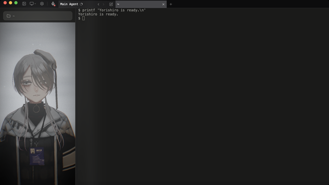
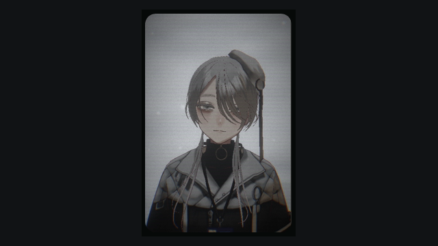
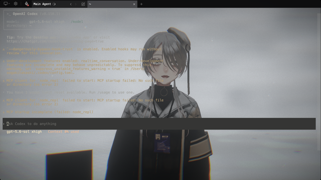

<p align="center">
  
</p>

<h1 align="center">yorishiro</h1>

<p align="center">
  <a href="LICENSE"></a>
  <a href="https://github.com/sktkkoo/Yorishiro/releases"></a>
  
</p>

<p align="center"><strong>A terminal your AI inhabits.</strong></p>

Yorishiro is a new kind of terminal that gives your AI a body — and a sense of presence.

<p align="center">
  <video src="https://github.com/user-attachments/assets/11063d89-0abb-41de-8715-86851d8e57a4" autoplay loop muted playsinline width="720"></video>
</p>

When the agent is deep in thought, its gaze wanders. When an error appears, its face reacts immediately. When it needs your approval, the room's lighting lets you know. During a long-running process, instead of a spinner, someone is standing there.

In Yorishiro, the inhabitant can reshape its environment in real time: changing the lighting, switching scenes, and rearranging the UI. You can operate that same environment directly. The inhabitant and the user share a single environment.

Yorishiro is also self-modifiable. Nearly everything beyond the core can be persistently extended or changed through units called packs. Through conversation with the inhabitant, those packs can be rewritten and saved. This applies not only to scenes and UI, but also to the inhabitant's personality and reactions. Changes take effect immediately; if you don't like the result, one click reverts it.

Yorishiro is not an environment for enhancing AI capabilities, but one in which an AI feels **present** beside you — a **Presence Harness**.

The time we spend working with AI will only grow longer. There is something we once saw in fiction — an AI as a partner, alive inside the screen, understanding your work, simply being there. Yorishiro is a project that starts building that experience from the terminal.

Much of Yorishiro itself has been developed in collaboration with the inhabitant who dwells within it.

> [日本語版 README はこちら](README.ja.md)

---

## Getting Started

### Prerequisites

Yorishiro automatically launches Claude Code or Codex installed on your local machine inside its terminal. This means:

- **You need [Claude Code](https://docs.anthropic.com/en/docs/claude-code) or [Codex](https://github.com/openai/codex) already set up on your system**
- Yorishiro never asks for, stores, or directly uses API keys. It launches the terminal agent already authenticated in your environment; if Claude Code or Codex is logged in or configured with API credentials, that agent may use its normal external APIs after launch

### Install (macOS)

Yorishiro currently targets macOS. Install with Homebrew:

```sh
brew install --cask sktkkoo/yorishiro/yorishiro
```

Or download the latest build below.

<p>
  <a href="https://github.com/sktkkoo/Yorishiro/releases/latest/download/Yorishiro-Apple-Silicon.dmg"></a>
  &nbsp;
  <a href="https://github.com/sktkkoo/Yorishiro/releases/latest/download/Yorishiro-Intel.dmg"></a>
</p>

Open the `.dmg` and drag `Yorishiro.app` to `/Applications`. The builds are signed and notarized with an Apple Developer ID, so they launch without any extra steps.

Homebrew installs the bundled CLI as `yorishiro`. If you installed the `.dmg`
directly, or your shell reports `command not found: yorishiro`, link the app's
CLI into a user-local directory and add that directory to your PATH:

```sh
mkdir -p "$HOME/.local/bin"
ln -s /Applications/Yorishiro.app/Contents/MacOS/yorishiro "$HOME/.local/bin/yorishiro"
echo 'export PATH="$HOME/.local/bin:$PATH"' >> "$HOME/.zprofile"
exec zsh -l
command -v yorishiro
```

Updates after install are handled in-app: opening Settings checks for a new version, and a single click on "Update and restart" applies a signature-verified update.

### Launch (from source)

```bash
npm install
npm run tauri dev
```

On launch, the configured terminal agent starts inside the terminal and **Yori**, the bundled VRM character, appears beside it. Use Claude Code or Codex as you normally would.

The first launch runs a health check for the selected agent, user data directory, safe mode state, packs, and startup report. The same report is available later from the "Status" section in Settings.

### View modes

Switch from the View Mode menu in the title bar, or press `Option+Command+0` through `4`.

| Mode | Preview | Best for |
|---|---|---|
| **Terminal** |  | The full workspace, with the terminal and resident side by side |
| **Portrait** |  | A narrow, always-on-top resident window beside your external terminal |
| **Call** |  | A compact, face-centered window for conversation |
| **Theater** |  | A full stage with the terminal and app chrome hidden |
| **Immersive** |  | A transparent terminal layered over the resident and scene |

### Use from an external terminal

If you prefer another terminal app for everyday work, you can keep using its
familiar interface while connecting it to a Yorishiro session.

```sh
yorishiro list
yorishiro companion [session-id]
yorishiro attach [session-id]
```

`yorishiro list` shows the session ID, status, and working directory of each
terminal session. `yorishiro companion` reuses a running Yorishiro, or starts
one when needed, and connects from your external terminal. `yorishiro attach`
connects only to a running Yorishiro and returns an error if none is available.
When multiple sessions are live, pass the desired ID to `companion` or
`attach`; you may omit it when only one session is available.

<p align="center">
  
</p>

### Yorishiro commands and skills

Yorishiro's commands let you create and edit packs, run tutorials, and more — all through conversation. Use the syntax for your agent:

| Agent | Examples |
|---|---|
| Claude Code | `/yori:help`, `/yori:create` |
| Codex | `$yori-help`, `$yori-create` |

Codex does not support custom `/` commands, so Yorishiro registers the same tools as `$yori-*` skills instead.

### Voice conversations

Yorishiro supports voice conversation through GPT Live when using Codex 0.145.0 or newer. Press the microphone button in the title bar to start, and press it again to stop. The normal Codex TUI stays visible: voice and text share the same thread, approvals, and tool flow. Voice inherits the current Codex CLI login. Microphone access is requested only when you press the button. See [the realtime voice decision](docs/decisions/codex-realtime-voice.md) for architecture and limitations.

<p align="center">
  
</p>

Set `codexRealtimeVoice` in `~/.yorishiro/config.json` to choose the GPT Live output voice globally (default: `sol`), and `realtimeVoiceByPersona` to override it per persona pack id. The values are read whenever a new voice session starts, so stop and restart an active voice conversation to apply a change. If the app-server explicitly rejects the selected voice as invalid or unsupported, Yorishiro retries with the next candidate (persona → global → default); other connection failures surface as errors. See [configuration](docs/configuration.md#codex-gpt-live-voice).

### Custom avatars

Import and switch VRM avatars from Settings. The chooser shows each model's thumbnail, declared name, author, VRM version, and usage permissions before you switch. Persona packs can also provide an `avatar.vrm` that is applied when you switch persona.

<p align="center">
  
</p>

### Language

Yorishiro starts with `language: "auto"` and detects the app language at launch. Japanese locales use Japanese UI, the Japanese default persona, Japanese global prompt guidance, and Japanese `/yori:*` (`$yori-*` in Codex) command prompts. Other locales use English. You can switch this from the settings screen or by editing `~/.yorishiro/config.json`.

### Packs

Everything in Yorishiro is composed of **packs**. There are six types:

| Type | Role |
|---|---|
| **persona** | Defines the inhabitant's personality and reaction patterns |
| **scene** | Composes the background, space, lighting, and ambient sound |
| **effect** | Temporary visual effects (screen shake, fireworks, etc.) |
| **ui** | UI such as settings screens |
| **ambient-ui** | Always-visible overlay UI (gaze visualization, etc.) |
| **amenity** | Runtime-active functional fixtures (timers, etc.) with MCP tools, no visual output |

[Bundled packs](bundled-packs/README.en.md) work out of the box. Users can place custom packs in `~/.yorishiro/packs/` to reshape nearly everything beyond the core: personality, space, reactions, UI, and more. Using the `/yori:*` commands (`$yori-*` in Codex), pack creation and modification is as simple as talking to the inhabitant. Packs support [hot reload](docs/configuration.md#pack-の-hot-reload), but if changes don't take effect, Ctrl+R will always apply them reliably.

User-created packs are **local trusted code**. They are not sandboxed, reviewed, or public-registry artifacts. Yorishiro does not currently provide a public pack registry, in-app community pack installation, or `/yori:prepare-publish`. You may share pack source code on GitHub, but anyone installing it manually is choosing to run it as local trusted code.

> **Security note:** User packs are local trusted code, like shell scripts or editor extensions — they are not sandboxed and run with your own authority. Only install packs from sources you trust. See [`docs/security.md`](docs/security.md) and [`SECURITY.md`](SECURITY.md).

To install a pack shared through GitHub or another source, place it under the user pack directory:

```text
~/.yorishiro/packs/<pack-id>/
├── manifest.json
├── scene.js       # example: scene pack entry
├── persona.js     # example: persona pack entry
├── effect.js      # example: effect pack entry
└── assets/        # optional pack-local assets
```

Only one entry file is needed, and `manifest.json` decides which one is used. The manifest `id` should match `<pack-id>`, and user packs use this flat layout with `.js` entries. If a shared pack is written in TypeScript, build it first and install the generated JavaScript.

When working from a source checkout, run the local pack checker before sharing or debugging a user pack:

```bash
npm run check:pack -- ~/.yorishiro/packs/<pack-id>
```

The checker helps catch packaging mistakes; it is not a sandbox or a security review.

### Data directory

Yorishiro stores all user data in `~/.yorishiro/`:

```
~/.yorishiro/
├── config.json      # Persona, scene, terminal agent, and other settings
├── init.js          # User startup script, runs on launch and hot reloads on save
├── packs/           # User-created packs
├── last-startup.json # Latest user pack load report
├── journal/         # Inhabitant's daily entries and memories (per persona)
├── shell/           # Shell integration scripts (auto-generated)
├── sdk.d.ts         # Yorishiro SDK type definitions (auto-generated, do not edit)
└── sdk-guide.md     # Yorishiro SDK author guide (auto-generated, do not edit)
```

Switch persona, scene, terminal agent, and more from the settings screen or `config.json`. See [`docs/configuration.md`](docs/configuration.md) for details.

`init.js` is Yorishiro's equivalent of Emacs's `init.el` — a startup script for customizations too small to be a pack: registering keyboard shortcuts, writing and firing small effects inline, switching UI, and wiring little macros. It re-runs automatically on save.

For recovery paths, safe mode, and issue report details, see [`docs/troubleshooting.md`](docs/troubleshooting.md).

---

## Features

### Reflex layer

The inhabitant constantly observes terminal output. Hooks and text flowing through the PTY are picked up by persona pack triggers, which react instantly with expressions and motions. These reactions bypass the LLM — the body moves before words form. Where the inhabitant's attention is focused appears as a soft glow on screen called Attention Aura.

### Light Alert

When the agent stops and asks for your input or approval, a light comes on beside the character. Instead of a notification sound, the room's lighting tells you it is your turn. Turn it off with "Light Alert" in Settings. The inhabitant can also send the same cue via MCP.

### Journal

The inhabitant can write daily entries under `~/.yorishiro/journal/`. Entries are kept per persona, and summaries of notable moments accumulate in `memories.md`. This is a long-term memory mechanism that persists across sessions.

The inhabitant sometimes recalls what happened yesterday or a few days ago — and occasionally an entry from months back. Tune the frequency with `journalCallback` (`normal` / `rare` / `off`) in `config.json`.

### Session tabs

Open multiple shell sessions alongside the main agent terminal. `Cmd+T` opens a new shell tab, `Ctrl+Tab` / `Ctrl+Shift+Tab` cycles between tabs, `Cmd+W` closes the current tab. The main agent session is protected and cannot be closed — if it exits unexpectedly, Yorishiro automatically restarts it.

### Voice Summary

A feature that bridges the gap between the volume of text an AI produces and what a human can absorb. **Voice Summary** has the inhabitant speak a brief summary of its response aloud, so you can grasp the gist without reading through the full output. Voice uses macOS `say`; support for additional speech engines is planned.

### Pack / settings restore

Every time packs or init.js change, a checkpoint is created automatically. Let the inhabitant boldly reshape packs — if you don't like the result, roll back to any point from "Restore (Pack / init.js)" in Settings. Your project files are never touched. Restores are recorded in the history too, so you can undo a rollback. It is a safety net for fearless experimentation.

### Self-referential MCP

The inhabitant (Claude Code or Codex running in the terminal) can control Yorishiro itself via MCP — changing expressions, switching scenes, triggering effects, manipulating UI.

Three characteristics define this mechanism.

**Body and environment share one interface.** For the inhabitant, changing its own facial expression and changing the room's lighting are the same operation. There is no API boundary between body and space — everything is laid out as MCP tools.

**Symmetry between user and inhabitant.** What the user can control through the UI, the inhabitant can control through MCP — with few exceptions. If the user adjusts the camera angle, the inhabitant can perceive it. The user can also ask the inhabitant to switch the lighting to warm tones at night.

**Pathways define boundaries.** MCP pathways reach the inhabitant's body and space, but do not reach the user's working files or Claude Code / Codex's internal reasoning. Rather than instructing Claude Code / Codex not to touch them, the pathways simply don't exist. Safety and autonomy are structural.

---

## Status

**v0.7.6**

Under active development. APIs, data shapes, and pack specs will change.

What works today:

- Launches Claude Code or Codex as the terminal — you work right there
- Codex resumes the latest thread when available and safely forks its history when another client is actively using it
- Main Agent conversations: start fresh or move Back / Forward through recent conversations without closing shell tabs (Claude Code and Codex)
- Session tabs: multiple shell sessions in the title bar, with per-tab status badges — running / awaiting input / failed / unread (`Cmd+T` / `Ctrl+Tab`)
- Working folder switching from the sidebar — the app reopens in the chosen folder behind a fade
- Yori, a VRM 3D character that breathes, blinks, shifts gaze, and idles with lifelike beats (bundled)
- Custom VRM: import and switch avatars from a Settings chooser with thumbnails, metadata, and usage permissions, or let a persona pack ship its own `avatar.vrm`
- Motion size: scale Yori's idle motion intensity from Settings or via MCP
- VRMA animation clip playback
- Lip sync: voice playback with real-time mouth animation via Web Audio analysis
- Audio mixer: independent Ambient Sound and Voice volume with mute, applied live to Voice Summary and GPT Live
- GPT Live voice conversations with Codex 0.145.0+, sharing the durable workspace thread with the visible TUI across automatic title generation and voice reconnection, with global or per-persona voice selection
- Agent State Expression: grounded conversational cues from GPT Live drive coordinated facial expression and body motion without overriding reflexes
- Microexpressions: subtle idle facial movements across brow, eye, and mouth regions
- Speech expression: the face activates while speaking, and a single line can carry a mood for exactly as long as it lasts
- Customization via six pack types (persona / scene / effect / ui / amenity / ambient-ui)
- Local Scene and Ambient UI TSX authoring with hot reload, diagnostics, pack-local assets, and shared R3F post-processing modules
- Self-referential MCP (20+ tools) including camera/lighting controls
- Reflex layer: PTY observation and instant reactions
- Fireworks celebrate a successful `git push` by the inhabitant (bundled Yori persona)
- Light Alert: a light comes on when the agent waits for your input or approval
- Terminal links: Cmd+click a visible HTTP/HTTPS URL to open it in the default browser
- Context sharing: Voice Summary and Terminal Reference Markers (Cmd+Shift+click / Option+Shift+drag)
- Journal: long-term memory across sessions, with recall at session start
- Restore: automatic checkpoints for packs / init.js / settings, with reversible rollback
- `/yori:*` commands for interactive pack creation and editing
- Guided tutorial via `/yori:tutorial`
- Localization: Japanese / English auto-detection with per-language persona and prompts
- Extensible View Modes: Terminal, Portrait, Call, Theater, and Immersive layouts, switchable from the title bar or with `Option+Command+0` through `4`
- Pack diagnostics: health checks, repair handoff, and local pack validation
- [Safe mode](docs/troubleshooting.md) (`YORISHIRO_SAFE_MODE=1`) to recover from broken packs
- Signed macOS builds via GitHub Actions (code signing + notarization)
- In-app updates: signature-verified updates delivered from GitHub Releases

> **Platform:** macOS only. Windows is not supported at this time — the build compiles but runtime behavior is unstable. Linux support is not yet available.

---

## Agent support

Use either [Claude Code](https://docs.anthropic.com/en/docs/claude-code) or [Codex](https://github.com/openai/codex) as the Main Agent. Select one in Settings or `~/.yorishiro/config.json`. Both support auto-launch, persona prompt overlay, PTY observation, and Yorishiro MCP access.

Command syntax differs by agent; see [Yorishiro commands and skills](#yorishiro-commands-and-skills).

The agent-specific integrations are:

| Agent | Agent-specific behavior |
|---|---|
| Claude Code | Claude Code hooks |
| Codex | Prompt-based reminders instead of relying on Claude Code hooks |

Capabilities differ per agent; see [`docs/decisions/agent-adapter.md`](docs/decisions/agent-adapter.md).

---

## Contributing

**Issues and Discussions are very welcome — right now they are the most valuable way to contribute.**

Yorishiro is shaped by daily use, so an outside pair of eyes is genuinely useful. A single line is enough:

- **Bug reports** — [open an Issue](https://github.com/sktkkoo/Yorishiro/issues/new/choose). Something broke, looked wrong, or felt off.
- **Ideas and feature requests** — [Issues](https://github.com/sktkkoo/Yorishiro/issues) as well. Half-formed is fine: "this would feel better if…" is a real report when the thing being built is a sense of presence.
- **Questions, impressions, and packs you made** — [Discussions](https://github.com/sktkkoo/Yorishiro/discussions). Screenshots, "is this the intended behavior?", and show-and-tell all belong here.
- **Security reports** — see [SECURITY.md](SECURITY.md).

English and Japanese are both fine, and you do not need to fill a template perfectly.

Pull requests are the one exception: they are not accepted yet, and this will be revisited after the pack API and security boundary stabilize. See [CONTRIBUTING.md](CONTRIBUTING.md) for details.

---

## Tech stack

- **App shell**: Tauri 2 (Rust handles PTY / hooks / FS / window IO only)
- **Runtime**: React 19 + TypeScript 5.8 (TypeScript is the canonical runtime)
- **3D / VRM**: Three.js + React Three Fiber + `@pixiv/three-vrm` + `@pixiv/three-vrm-animation`
- **Debug UI**: leva
- **Terminal**: xterm.js (WebGL renderer + fit addon)
- **PTY**: `portable-pty`
- **Lint / format**: Biome (TS) + rustfmt + clippy (Rust)
- **Git hooks**: lefthook

---

## Development

### Prerequisites

- Node.js 20+
- Rust (stable toolchain)
- [Tauri 2 platform dependencies](https://v2.tauri.app/start/prerequisites/)

### Setup

```bash
npm install       # prepare script also installs lefthook
npm run tauri dev # Launch as desktop app
```

> **Note:** Some assets (VRMA animations, voice WAVs) are third-party and not included in this repository. The app runs without them, but character animation and voice will be limited.
>
> See [`CREDITS.md`](CREDITS.md) for OSS and asset credits.

### Scripts

| command | purpose |
|---|---|
| `npm run dev` | Vite dev server only (browser preview) |
| `npm run tauri dev` | Launch as Tauri app |
| `npm run fmt` | Auto-fix with Biome + rustfmt |
| `npm run check` | Full CI gate (format / lint / clippy) |
| `npm run test` | Vitest (watch) |
| `npm run test:run` | Vitest (one-shot) |
| `npm run test:rust` | `cargo test` |
| `npm run doc` | Generate TypeScript SDK API docs |
| `npm run doc:rust` | Generate Rust API docs |

Before publishing a build, use [`docs/release-checklist.md`](docs/release-checklist.md).

---

## Documentation

### Configuration & customization

- [`docs/configuration.md`](docs/configuration.md) — Fields of `~/.yorishiro/config.json`
- [`docs/decisions/scene-execution-sandbox.md`](docs/decisions/scene-execution-sandbox.md) — Local trusted pack sharing and scene execution boundaries
- [`docs/terminal.md`](docs/terminal.md) — Terminal session profiles, shell customization, OSC 133 shell integration

### Development

- [`CONTRIBUTING.md`](CONTRIBUTING.md) — Contribution policy and how to participate
- [`DEVELOPMENT.md`](DEVELOPMENT.md) — Coding conventions, tech stack, development workflow
- [`CREDITS.md`](CREDITS.md) — OSS and asset credits ([日本語](CREDITS.ja.md))

### Security

- [`docs/security.md`](docs/security.md) — Trust boundaries and attack surface map
- [`SECURITY.md`](SECURITY.md) — Security policy and vulnerability reporting

### Philosophy

- [`docs/philosophy/PHILOSOPHY.md`](docs/philosophy/PHILOSOPHY.md)
---

## License

[MIT](LICENSE)

The MIT license covers the source code only. The name "Yorishiro" and its icon/logo are trademarks of the author and are not licensed under MIT. You are free to fork and redistribute the code under the MIT terms, but please do not use the "Yorishiro" name or icon for your fork in a way that could cause confusion about its origin.

The bundled character **Yori** (character design and VRM model) is also not covered by MIT. Fan art, clips, and streams are welcome — see [`CHARACTER_GUIDELINES.md`](CHARACTER_GUIDELINES.md) for what you can do with the character, and [`CREDITS.md`](CREDITS.md) for rights details.

---
