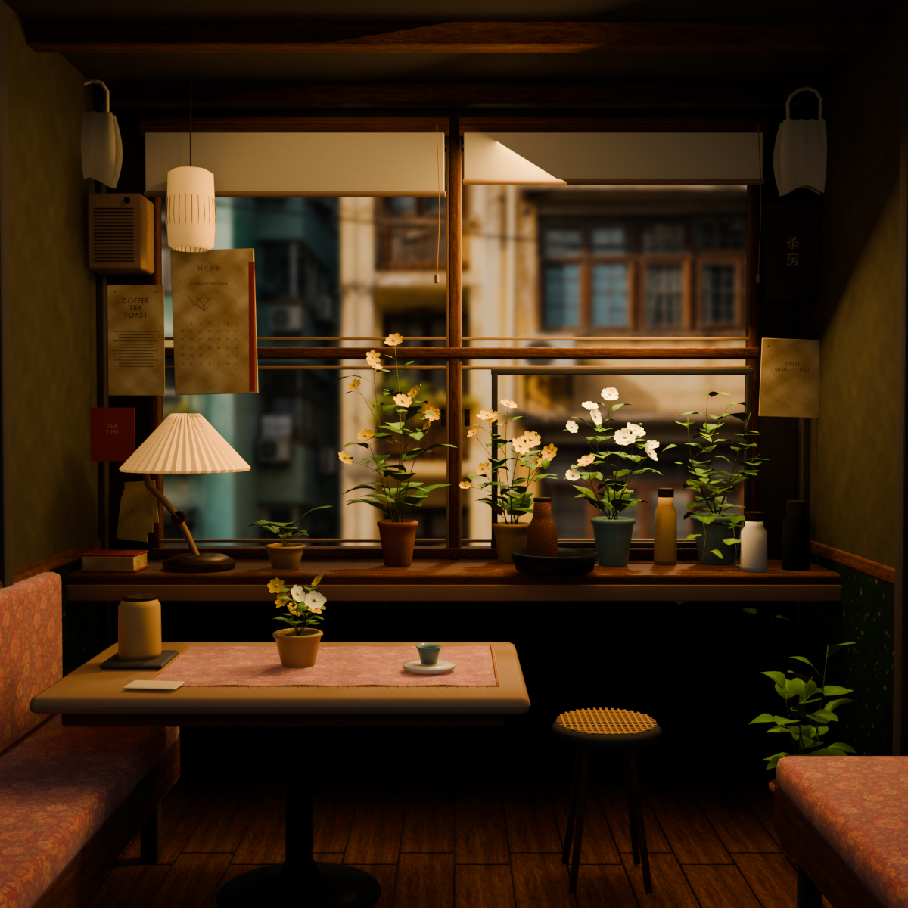

# Twilight Café

An amber-lit evening café with old window frames, jade walls, walnut furniture, paper lamps and seven flowering plants.

The saved preview uses Blender Eevee with the window glass hidden for the preview only. The shipped GLB retains its transparent glass; its appearance was verified separately in Yorishiro.

## Model and materials

`assets/room-polished.glb` is the 0.4.1 room: **73,864 triangles, 31 meshes/primitives, 31 materials and 23 embedded images**, approximately 25.01 MiB. These counts exclude the avatar. The original 236,282-triangle model was reduced by 68.74%; matching materials are consolidated.

The model includes local contact AO, textured wood and fabric, generated leaf veins, glazed ceramic vessels and a blurred courtyard image. All 284 leaves remain: actual leaf/petal intersections were corrected by rotating affected leaves and petioles, preserving natural overlap. The menu sits in front of the window frame, 5 cm above the red notice and 5.5 cm below the speaker. The hidden floor crock remains removed.

The foliage adapter adds restrained reverse-side diffuse response to directional light after shadow attenuation. It uses no extra render pass and falls back to ordinary PBR if Three.js shader chunks change. Ceramic clearcoat is authored in the GLB. A 64px environment cube is captured from local Lightformers on setup and control-driven updates, without per-frame capture. No external textures or decoders are required. Window and bottle glass use front-face alpha blending instead of screen-space refraction, avoiding an extra opaque render and full-resolution multisampled transmission buffer each frame.

Model-cache materials, geometry and textures are never mutated or disposed by this pack; only its own material clones are disposed. The distant courtyard is unlit, while room materials use the host lighting and shadow settings.

## Placement and controls

The room uses meters and Y up; the window is toward negative Z and the camera views from positive Z. Room geometry and lighting start 1.6 m behind the resident. The avatar and Common camera remain under host control.

F2 → Scene exposes `room.distance` and the `lights` folder. Starting values are ambient 0.05, window 1.15, paper lamps 2 and resident fill 0.5. The parchment terminal background and dark foreground remain readable on light input/message blocks; surrounding UI stays dark jade.

Scene Layers exposes only the foreground overlay. The room and courtyard are part of the 3D model, so there is no separate background media layer.

## Registration and earlier local copies

Display name: **Twilight Café**. Stable pack ID: `amber-window-room`, retained so existing project selections and controls continue to work. This adds a selectable bundled scene; it does not change the fresh-install default.

An earlier same-ID local pack overrides this bundled version. Keep that working copy until a build containing Twilight Café is installed. To use the bundled copy afterward, back up the local pack outside the user packs directory, then restart the app. Removing an active local override alone does not automatically re-register its bundled counterpart.

See [asset provenance](assets/PROVENANCE.md) for the model and texture production record. Editable Blender files, source texture maps and rebuilding scripts are retained in the local `Autodesk/yorishiro-amber-room` authoring project; the runtime GLB is self-contained.

## Performance validation

A live comparison at the same 2666 × 1600 drawing-buffer size and DPR 2 reduced renderer draw calls from 70 to 35 and rendered triangles from 365,560 to 182,780, including the avatar. The model itself retains 73,864 triangles. The host limits rendering to 30 FPS: 12-second samples after a 3-second warm-up measured 28.55 FPS before and 28.09 FPS after, so these samples do not establish an FPS gain. GPU time was not measured. The user reported the lighter version felt more responsive; the measured improvement is reduced rendering work.

`node scripts/optimize-twilight-cafe.mjs INPUT OUTPUT` reapplies the two-material optimization after a Blender export. It preserves the binary geometry/image chunk and refuses to overwrite an existing output. Asset regression checks protect against reintroducing transmission.
