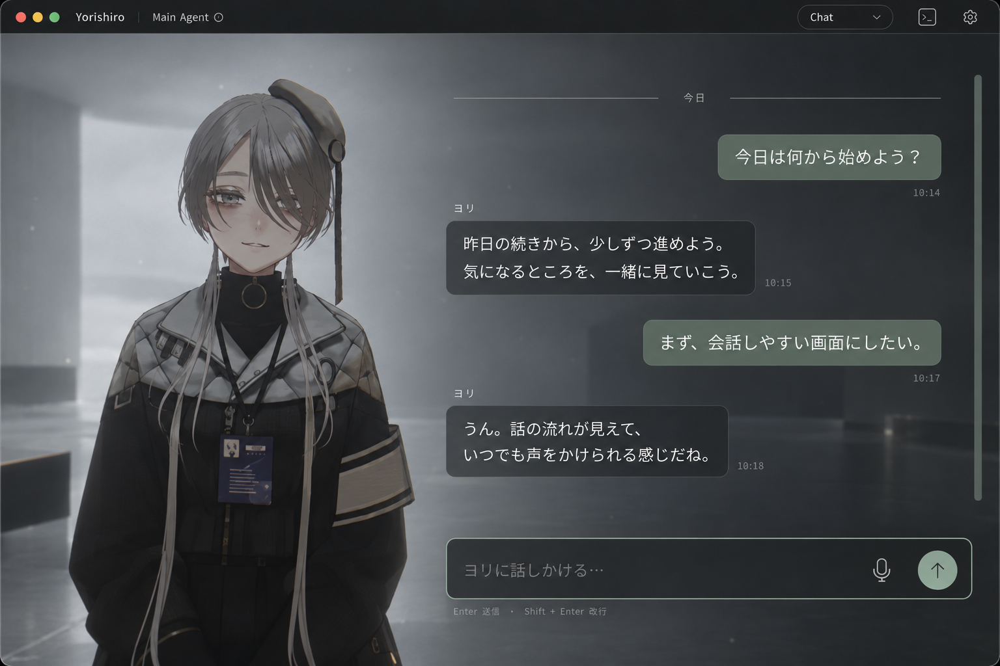

# Chat View Mode — image proposal

Status: initial visual proposal, followed by an approved implementation adjustment. The generated image depicts the original proposal, not a running feature.

The implementation preserves the existing resident viewport and replaces the terminal area with Chat, as requested after reviewing camera and gaze behavior. Approvals now use cards above the composer; the bottom terminal action switches View Mode. Voice and text can be used together. See the [implementation decision](../../decisions/chat-view-mode.md) and [usage guide](../../../bundled-packs/ui/chat/README.md).

The first implementation previews ([normal](review/normal.png), [inline controls](review/approval.png), [900×600](review/compact.png)) are historical. The revised component previews show [long history](review/long-history.png), [approval cards](review/approval-cards.png), and [long error details](review/long-error.png). The ongoing-permission flow is shown at [1280×800](review/ongoing-approvals.png) and [900×600](review/ongoing-approvals-compact.png), including the session button and expanded saved-rule scope. These use fixture messages and are not live provider approvals.

Branch: `feat/chat-view-mode`

Base: `4132dd47` on local `main`.

## Intent

Give the existing resident a persistent, readable conversation surface in the same inhabited scene. Preserve the resident's face, body language, and environmental presence while making earlier exchanges easy to read.

The proposal extends the existing Quick Chat composer into a dedicated View Mode. A continuous scene, shared lighting, and restrained translucent message surfaces connect the resident and the conversation. The text area receives a darker backing for contrast without a hard split between the resident and the conversation.

## Image

Generated with the built-in `image_gen` tool using the existing Immersive screenshot and Call portrait. The complete generation prompt is in [imagegen-prompt.md](imagegen-prompt.md).

- Keep the existing charcoal, off-white, and sage theme. These are scene-provided colors, not a new fixed theme.
- Retain the resident on the left in the continuous scene and place the conversation in a wider reading area on the right.
- Distinguish user turns with a restrained sage surface. Use quieter surfaces and a small resident name for replies.
- Anchor a persistent composer below the transcript. Reuse the existing input treatment and up-arrow send affordance.
- Keep View Mode, terminal access, and settings in quiet chrome. The image shows the chrome exposed for discoverability; its idle reveal behavior remains a design detail.
- Show one muted microphone affordance for entering the existing voice mode. The final implementation explicitly permits text entry and GPT Live together.

## Interaction intent for implementation

| State | Intended behavior |
| --- | --- |
| Reading | Scroll previous turns without losing the active conversation or the resident. Keep text off the resident's face. |
| Composing | Persistent input, Enter to send and Shift+Enter for a new line; respect IME composition. |
| Working | Drive resident and scene feedback from actual runtime events. Preserve the transcript without inventing progress meters or simulated thought text. |
| Reply arrives | Add a readable reply. Follow new content only while the user is already at the bottom. |
| Terminal interaction required | Provide a direct route to the underlying terminal so approvals, errors, and interactive prompts remain accessible. |
| Voice mode | Reflect actual voice availability; the final implementation allows voice and text together. |

The image covers a normal desktop reading state. Narrow-window layout, long code blocks, failures, and voice transitions still require interaction design before implementation.

## Existing integration boundaries

- View Modes are registered through UI-pack manifest metadata. Existing display names are Terminal, Portrait (`companion`), Call (`portrait`), Theater, and Immersive.
- Quick Chat currently explicitly supports `companion`, `portrait`, and `theater` in `src/runtime/quick-chat-input.ts`. Chat would need host integration as well as a new pack.
- The host submits user text into the main terminal session in `src/App.tsx`. UI packs deliberately do not receive arbitrary PTY write access.
- A persistent transcript is new functionality. The existing Codex thread tracker correlates Quick Chat prompts and completed assistant replies for speech; it is not a complete, agent-independent transcript UI contract.
- Text Quick Chat is enabled only while GPT Live is fully idle. The transcript source, supported agents, incomplete replies, and conversation restoration need explicit treatment during implementation.
- Attachments, regeneration, model switching, and chat search are outside this visual proposal.

## Design references

- [Philosophy: UI as an inhabited environment](../../philosophy/PHILOSOPHY.ja.md)
- [Presence before spectacle](../../decisions/presence-over-spectacle.md)
- [Existing UI palette and Quick Chat styles](../../../src/App.css)
- [Immersive screenshot](../../assets/view-mode-immersive.png)
- [Call screenshot](../../assets/view-mode-call.png)

The original image and prompt are retained as the visual reference. The implemented layout uses the accepted terminal-area fallback rather than moving the camera.
